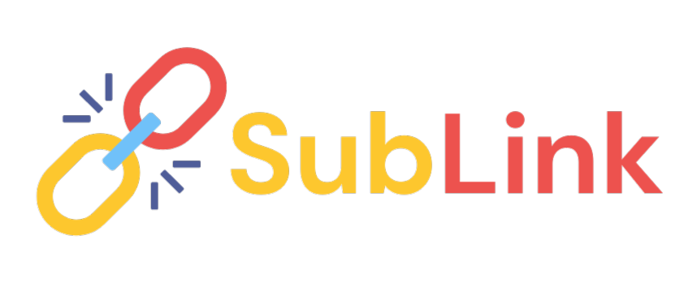
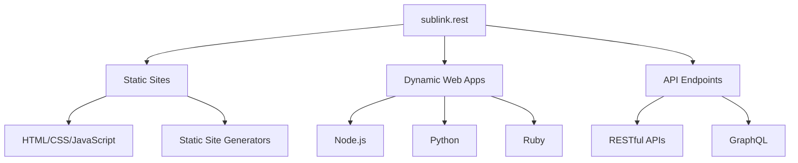

  
  <h1>sublink.rest</h1>
  
<strong>Empowering Digital Innovation with Free Subdomains</strong>

  
  
  
  

## 🚀 Our Mission

At sublink.rest, we're dedicated to breaking down barriers in web hosting. Our platform provides free subdomains, empowering developers, creators, and innovators to bring their ideas to life online, regardless of their experience or resources.

## 🌟 Key Features

- **📌 Free Subdomains**: Launch your project with a custom subdomain, no strings attached.
- **🖥️ Personal Site Hosting**: Create your digital identity with ease.
- **🌐 Open-Source Project Showcase**: Give your open-source projects the visibility they deserve.
- **🛡️ Reliable Infrastructure**: Built on robust systems for maximum uptime and performance.
- **🤝 Community-Driven**: Join a network of passionate developers and creators.

## 🏁 Quick Start Guide

1. **Visit [sublink.rest](https://sublink.rest)**
2. **Choose your unique subdomain**
3. **Set up your site using our intuitive dashboard**
4. **Deploy and share your creation with the world**

## 💡 Why sublink.rest?

| Feature | Benefit |
|---------|---------|
| 100% Free | No hidden costs or surprise bills |
| User-Friendly | Simple setup process suitable for all skill levels |
| Scalable | Grow your project without changing your domain |
| Community Support | Access to a network of developers and resources |
| Open-Source Friendly | Perfect for hosting and showcasing open-source projects |

## 📊 Our Impact

| Active Subdomains | Projects Hosted | Global Reach | Uptime |
|:-----------------:|:---------------:|:------------:|:------:|
|     25,000+       |     10,000+     |  100+ Countries | 99.99% |

## 🛠️ Technologies We Support

## 🤝 Join Our Community

- **GitHub**: Star and watch our repositories
- **Telegram**: Join discussions in our [Telegram group](https://t.me/sublink_rest)
- **Newsletter**: Subscribe to our monthly developer digest
- **Blog**: Read our [tech blog](https://blog.sublink.rest) for tips and insights

## 📞 Get in Touch

We're here to support your journey:

- **Email**: [support@sublink.rest](mailto:support@sublink.rest)
- **Telegram**: [https://t.me/sublink_rest](https://t.me/sublink_rest)

## 🛡️ Security & Privacy

Your trust is paramount. We implement industry-leading security measures and respect your privacy. Learn more in our [Security Policy](https://sublink.rest/security) and [Privacy Statement](https://sublink.rest/privacy).

## 📜 License

sublink.rest is open-source software licensed under the [MIT license](LICENSE).

---

  <h3>Innovate. Create. Connect.</h3>
  
Powered by the sublink.rest team and our amazing community

